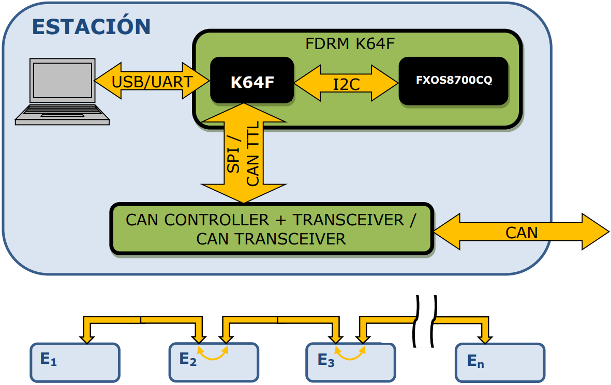
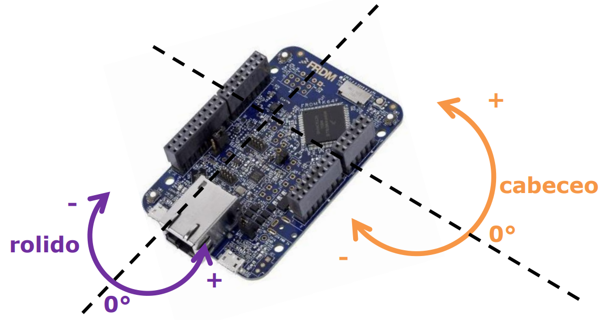

### 25.27 - Sistemas Embebidos

## Trabajo Práctico N° 2 - Comunicación Serie

**Se desea implementar una estación que obtenga la orientación de las placas FRDM K64F de todos los grupos y las muestre en una PC, utilizando los protocolos de comunicación UART, I2C, SPI y CAN.**

**1\. Descripción**

**1.1. Funcionamiento general**

Cada grupo debe implementar una estación que tenga las siguientes funciones:

- Determine la inclinación de la placa local, información que obtiene del integrado FXOS8700CQ mediante **I2C**.
- Lea la inclinación de las otras estaciones y comunique la inclinación propia, mediante **CAN**. Algunos grupos utilizarán un controlador CAN externo, que se comunica mediante **SPI**.
- Envíe la información de todas las estaciones (la propia y la de los otros grupos) a una PC mediante **UART** virtual (en realidad es USB pero la PC detecta un puerto COM) y la PC muestre la inclinación de todas las placas.

**1.2. Conexionado**

Cada estación de trabajo debe estar implementada como muestra la siguiente figura, y todas las estaciones deben estar interconectadas mediante CAN.

	

**1.3. Sensado de rolido, cabeceo y orientación**

La placa FRDM K64F posee un sensor acelerómetro y magnetómetro, el FXOS8700CQ, al cual la Kinetis se comunica mediante I2C.

Tras ser configurado, el acelerómetro brinda información de la aceleración producida en cada uno de los 3 ejes, que debe ser procesada para obtener el **rolido** y **cabeceo** de la placa, cada uno con un rango desde -179° hasta 180° y precisión 1°.

	

A su vez, es posible leer la **orientación** de la placa mediante el magnetómetro. Procesando dicha información, se puede obtener el valor de la orientación con un rango desde -179° hasta 180° y precisión 1° (0° para el Norte, 90° para el Este, 180° para el sur y -90° para el oeste).

**1.4. Comunicación entre estaciones**

Cada estación debe transmitir la información propia y recibir la información de las otras estaciones mediante el bus CAN.

1.4.1. Controller + Transceiver CAN

Se debe utilizar la placa CAN basada en el MCP25625 para interfacear la Kinetis con un bus CAN. Dicha placa puede ser utilizada tanto sola como _transceiver_ o _controller_ + _transceiver_.

Por lo tanto, hay 2 modos de uso:

- Utilizar el periférico CAN de la Kinetis como _controller_ y el MCP25625 como _transceiver_.
- Utilizar el MCP25625 como _controller_ + _transceiver_, siendo SPI la comunicación entre la Kinetis y el _controller_.

La cátedra decidirá el modo de uso que deberá implementar cada grupo.

Se adjunta el esquemático y el manual de usuario de la placa CAN.

**Atención**: Mucho cuidado al conectar las placas CAN entre sí. Alimentar la placa CAN desde VCC_CAN y que valga 5V. Nunca conectar las alimentaciones del MCU con la placa CAN si ambas generan tensión, esto generará un cortocircuito.

1.4.2. Protocolo CAN

El bus CAN funciona a una velocidad de **125 kBit/s**.

Cada estación debe funcionar como un nodo CAN cuyo ID es 0x100 + GN, donde GN es el número del grupo. Y debe aceptar solamente datos para valores de ID de 0x100 hasta 0x107 inclusive.

La información debe ser enviada en el _frame_ con el formato:

| angleId | angleVal |
| ------- | -------- |

- angleId: 1 byte con el caracter 'R' para identificar al rolido, 'C' para identificar al cabeceo y 'O' para identificar la orientación.
- angleVal: de 1 a 4 bytes conteniendo el valor del ángulo en formato ASCII. No se debe enviar el terminador del _string_ ('\\0'),

Por ejemplo, todos los siguientes _frames_ son válidos: 'R-34', 'C0', 'O67', 'R+138', 'R00', 'C-072', 'R+107', 'O000'.

Se debe recomienda implementar un uso eficiente del protocolo CAN, por lo que la frecuencia de envío de paquetes debe ser:

- Si cambió el ángulo: lo más rápido posible, pero controlando la frecuencia máxima de envío de paquetes a 20 por segundo.
- Si no cambió el ángulo: No dejar más de 2 segundos sin enviar inclinación.
- Considerar el rolido, cabeceo y orientación como casos independientes: si la placa no se movió se deben enviar 3 paquetes cada 3 segundos, si la placa cabecea se debe enviar cada 50ms el paquete de cabeceo y cada 2 segundos los otros paquetes.
- Considerar un cambio de ángulo si hubo una variación ≥5°, para evitar enviar mensaje por imprecisión en la medición.

**1.5. Comunicación FRDM K64F - PC**

La información obtenida, tanto de la placa propia como de las otras placas, debe ser enviada a la PC mediante UART y con un formato libre (cada grupo puede elegir el propio).

**1.6. Programa en PC**

La información recibida desde el puerto serie debe ser validada y luego utilizada para mostrar en la PC la inclinación y orientación de cada placa.

De ser posible graficar en 3D cada placa. Se puede utilizar Matlab, Visual C/C#, Python o cualquier otro software que permita comunicarse mediante el puerto serie y graficar en 3D. Utilizar una buena tasa de refresco, a fin de obtener una copia “lo más fiel posible” del estado real de las placas.

**1.7. Uso de CPU para la comunicación**

Se debe poder medir, el tiempo que le consume a la CPU el envío de datos por los distintos protocolos I2C, UART y CAN (no el tiempo que está enviando o recibiendo datos, sino el tiempo que le insume a la CPU realizar esta tarea).

Se penalizará el uso innecesario de CPU para la transmisión de datos.

**2 Requerimientos**

Los requerimientos obligatorios son necesarios para que el trabajo práctico esté aprobado, mientras que los requerimientos opcionales le dan valor (y puntaje) al trabajo, aunque no son necesarios para su aprobación.

**2.1 Requerimientos obligatorios**

- Lectura y cálculo del rolido y cabeceo.
- Transmisión y recepción de información mediante CAN acorde al formato especificado.
- Envío y visualización de los datos de todas las estaciones a la PC.
- Escritura de los drivers de los protocolos de comunicación serie utilizados.

**2.2 Requerimientos opcionales**

- Lectura y cálculo de la orientación.
- Envío optimizado de datos mediante CAN (límite superior e inferior).
- Graficado 3D de inclinación y orientación de todas las placas.
- Medición de uso de CPU.

**3\. Evaluación**

Para la nota del trabajo contemplará en orden los siguientes puntos:

1. Funcionamiento completo del equipo.
2. Proyecto de Kinetis, arquitectura y código fuente del firmware.
3. Drivers escritos para la comunicación serie, justificando su implementación.
4. Medición del uso de la CPU para la comunicación.
5. Programa de la PC.
